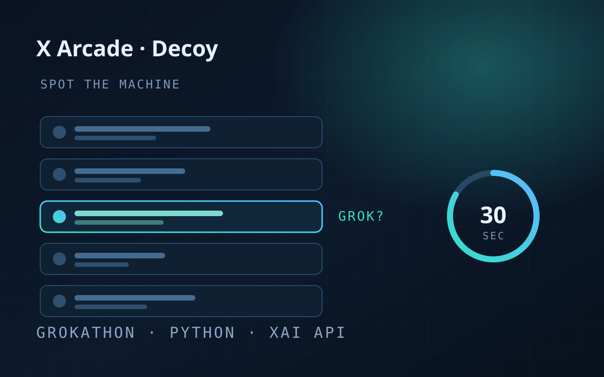
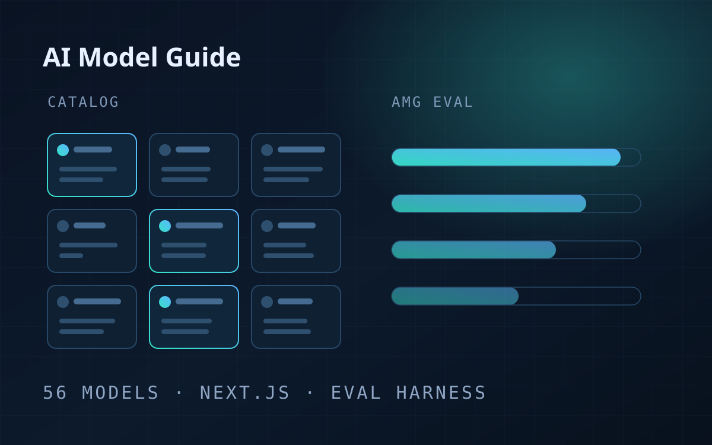
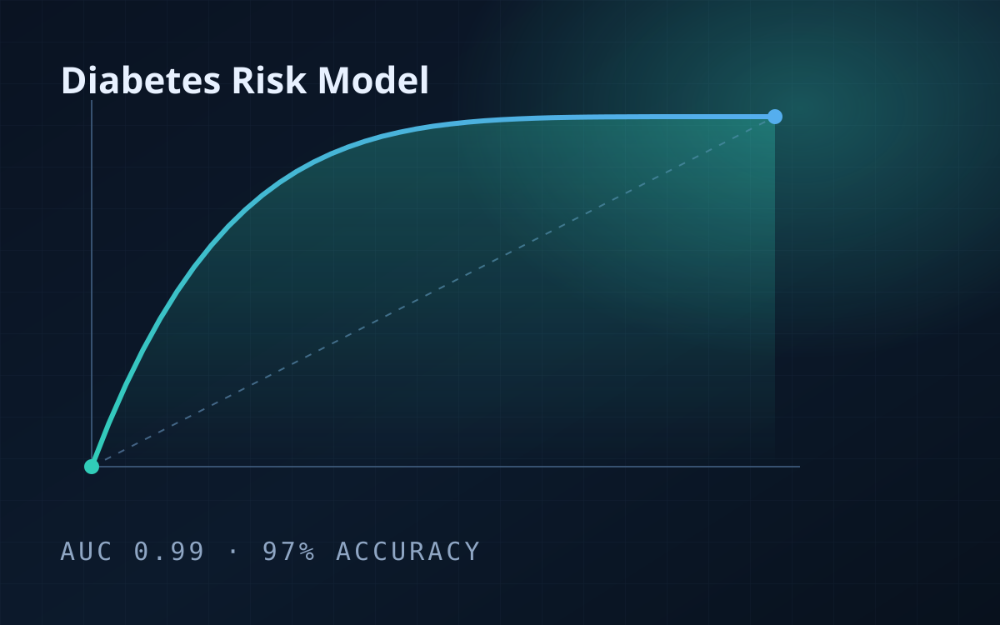
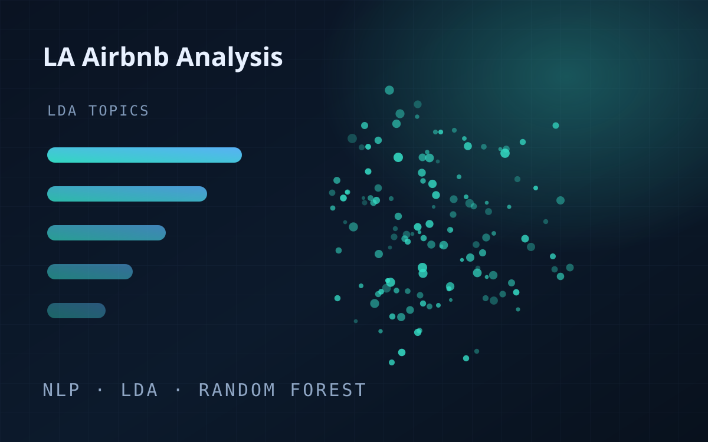
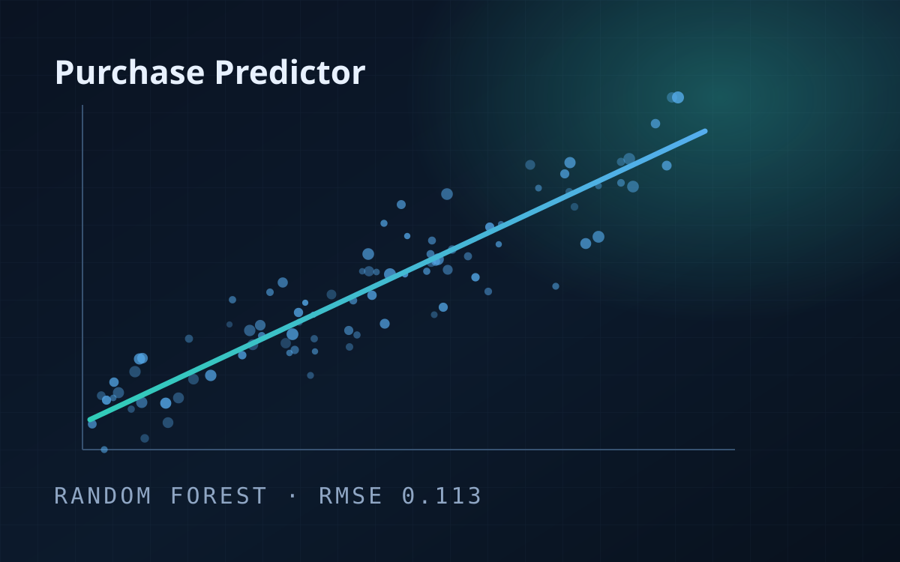
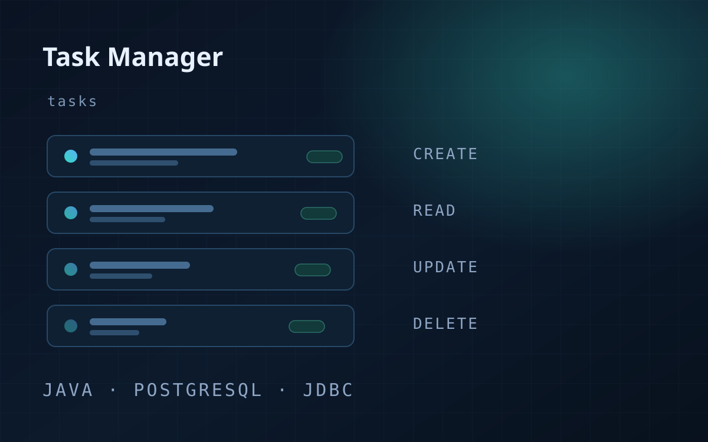

```{=html}
<!-- ═══════════════ HERO ═══════════════ -->
<section class="hero" id="top">
  <div class="hero-media">
    
  </div>
  <div class="hero-scrim"></div>

  <div class="wrap hero-inner">
    <div class="hero-copy">
      <p class="status"><span class="pulse"></span> Open to AI &amp; ML roles</p>

      <h1>Khang&nbsp;Thai</h1>

      <p class="hero-tagline">
        I build <span class="grad">retrieval and agentic AI systems</span> that turn dense technical archives into answers people can trust.
      </p>

      <p class="hero-sub">
        Master's student in Applied Data Science at USC, bioinformatics intern at Hologic,
        and a statistician by training — working where rigorous modeling meets production AI.
      </p>

      <div class="hero-actions">
        <a class="btn-solid" href="#projects"><i class="bi bi-grid-1x2"></i> View my work</a>
        <a class="btn-ghost" href="Khang_Thai_Resume.pdf" target="_blank" rel="noopener"><i class="bi bi-file-earmark-text"></i> Resume</a>
      </div>

      <ul class="social">
        <li><a href="mailto:khangthai348@gmail.com" aria-label="Email Khang"><i class="bi bi-envelope"></i></a></li>
        <li><a href="https://www.linkedin.com/in/khang-thai-361651203/" aria-label="LinkedIn"><i class="bi bi-linkedin"></i></a></li>
        <li><a href="https://github.com/kunfupen" aria-label="GitHub"><i class="bi bi-github"></i></a></li>
      </ul>
    </div>

    <div class="hero-portrait">
      <div class="frame">
        
      </div>
      <div class="portrait-tag">
        <span class="ico"><i class="bi bi-cpu"></i></span>
        <span>
          <span class="k">Currently</span>
          <span class="v">Bioinformatics Intern · Hologic</span>
        </span>
      </div>
    </div>
  </div>

</section>

<!-- ═══════════════ WHAT I BUILD ═══════════════ -->
<div class="wrap">
  <div class="stats reveal">
    <div class="stat">
      <span class="cap-ico"><i class="bi bi-layers-half"></i></span>
      <div class="cap-title">Retrieval</div>
      <span class="lbl">Hybrid dense and lexical search with cross-encoder reranking, over corpora where a wrong
      answer costs something.</span>
    </div>
    <div class="stat">
      <span class="cap-ico"><i class="bi bi-diagram-3"></i></span>
      <div class="cap-title">Agentic systems</div>
      <span class="lbl">LangGraph orchestration with dynamic tool selection, fallback routing and human approval
      gates.</span>
    </div>
    <div class="stat">
      <span class="cap-ico"><i class="bi bi-speedometer2"></i></span>
      <div class="cap-title">Evaluation</div>
      <span class="lbl">Benchmarks and model diagnostics built so the numbers hold up when someone checks them.</span>
    </div>
    <div class="stat">
      <span class="cap-ico"><i class="bi bi-graph-up"></i></span>
      <div class="cap-title">Statistics</div>
      <span class="lbl">Regression, cross-validation and feature analysis — the part that says whether a result is
      real.</span>
    </div>
  </div>
</div>

<!-- ═══════════════ ABOUT ═══════════════ -->
<section class="section" id="about">
  <div class="wrap">
    <div class="about-grid">
      <div class="reveal">
        <p class="eyebrow">About</p>
        <h2 class="section-title">Machine learning as the foundation, AI systems as the craft.</h2>

        <div class="prose" style="margin-top:1.6rem">
          <p>
            I'm a second-year master's student in <strong>Applied Data Science at the University of Southern
            California</strong>, and I finished my B.S. in Statistics and Data Science at <strong>UCLA</strong> in 2025.
            My training is classical — regression, model diagnostics, cross-validation, knowing when a result is real —
            and I've spent the last year pushing that foundation into applied AI.
          </p>
          <p>
            At <strong>Hologic</strong> I architected a hybrid retrieval pipeline that pairs dense vector search with
            lexical BM25 matching and cross-encoder reranking across a regulated assay-document corpus, then built an
            <em>agentic orchestration workflow in LangGraph</em> on top of it — stateful multi-step reasoning, dynamic
            tool selection, automated fallback routing, and human-in-the-loop approval gates backed by schema
            validation. Around it I built the <strong>MCP servers</strong> that give the agents structured access to
            internal tooling and data, and the <strong>evaluation harnesses</strong> used to measure what the pipeline
            returns before anyone relies on it. In a bioinformatics setting a confident wrong answer is worse than no
            answer, so most of the engineering went into making the system say what it actually knows.
          </p>
        </div>
      </div>

      <div class="facts reveal" data-delay="120">
        <dl>
          <div>
            <dt>Based in</dt>
            <dd>San Diego &amp; Los Angeles, CA</dd>
          </div>
          <div class="divider"></div>
          <div>
            <dt>Currently</dt>
            <dd>Bioinformatics Intern @ Hologic</dd>
          </div>
          <div class="divider"></div>
          <div>
            <dt>Studying</dt>
            <dd>M.S. Applied Data Science, USC — 2027</dd>
          </div>
          <div class="divider"></div>
          <div>
            <dt>Previously</dt>
            <dd>B.S. Statistics &amp; Data Science, UCLA — 2025</dd>
          </div>
          <div class="divider"></div>
          <div>
            <dt>Focus areas</dt>
            <dd>Applied AI · Machine learning · Agentic workflows · LLMs &amp; RAG</dd>
          </div>
          <div class="divider"></div>
          <div>
            <dt>Open to</dt>
            <dd>AI and machine learning roles</dd>
          </div>
          <div class="divider"></div>
          <div>
            <dt>Reach me</dt>
            <dd><a href="mailto:khangthai348@gmail.com">khangthai348@gmail.com</a></dd>
          </div>
        </dl>
      </div>
    </div>
  </div>
</section>

<!-- ═══════════════ EDUCATION ═══════════════ -->
<section class="section" id="education">
  <div class="wrap section-inner">
    <div class="section-head reveal">
      <p class="eyebrow">Education</p>
      <h2 class="section-title">Academic background</h2>
    </div>

    <div class="edu-grid">
      <article class="edu-item reveal">
        <div>
          <h3>University of Southern California</h3>
          <p class="deg">M.S. <a href="https://datascience.usc.edu/academics/master-of-science-in-applied-data-science/">Applied Data Science</a></p>
          <p class="course"><span>Coursework:</span> Machine Learning · Data Management · Deep Learning</p>
        </div>
        <div class="tl-when">Aug 2025 — May 2027<span class="place">Los Angeles, CA</span></div>
      </article>

      <article class="edu-item reveal" data-delay="80">
        <div>
          <h3>University of California, Los Angeles</h3>
          <p class="deg">B.S. <a href="https://statistics.ucla.edu/index.php/academics/undergraduate/statistics-major-worksheets/">Statistics and Data Science</a></p>
          <p class="course"><span>Coursework:</span> Statistical Models &amp; Data Mining · Data Analysis and Regression ·
          Computation &amp; Optimization for Statistics · Monte Carlo Methods · Statistical Programming with R ·
          Python for Data Science · Statistical Consulting · Databases</p>
        </div>
        <div class="tl-when">Sep 2023 — Jun 2025<span class="place">Los Angeles, CA</span></div>
      </article>

      <article class="edu-item reveal" data-delay="120">
        <div>
          <h3>San Diego Miramar College</h3>
          <p class="deg">Associate of Science</p>
          <p class="course"><span>Honors:</span> Dean's List, 2021 – 2023</p>
        </div>
        <div class="tl-when">Aug 2021 — May 2023<span class="place">San Diego, CA</span></div>
      </article>
    </div>
  </div>
</section>

<!-- ═══════════════ EXPERIENCE ═══════════════ -->
<section class="section" id="experience">
  <div class="wrap section-inner">
    <div class="section-head reveal">
      <p class="eyebrow">Experience</p>
      <h2 class="section-title">Where I've built things</h2>
      <p class="section-lede">Two internships, two very different problems: making a regulated document corpus
      answerable, and making money move reliably.</p>
    </div>

    <div class="timeline">
      <article class="tl-item reveal">
        <div class="tl-top">
          <div>
            <h3 class="tl-role">Bioinformatics Intern</h3>
            <span class="tl-org">Hologic, Inc.</span>
          </div>
          <div class="tl-when">
            June 2026 — Present
            <span class="place">San Diego, CA</span>
          </div>
        </div>
        <ul>
          <li>Architected a <strong>hybrid Retrieval-Augmented Generation pipeline</strong> combining dense vector
          search (Qdrant), lexical BM25 matching, and cross-encoder neural reranking (bge-reranker) across
          <strong>16,000+ controlled assay document chunks</strong>.</li>
          <li>Built an <strong>agentic orchestration layer</strong> with LangGraph to manage stateful multi-step
          reasoning, dynamic tool selection, and automated fallback routing across complex document analysis tasks.</li>
          <li>Implemented <strong>human-in-the-loop approval gates</strong> and structured Pydantic schema validation
          to mitigate hallucinations and meet rigorous bioinformatics regulatory standards.</li>
          <li>Designed scalable document ingestion and indexing microservices, streamlining processing workflows and
          accelerating knowledge discovery across internal assay datasets.</li>
        </ul>
        <div class="chips">
          <span class="chip hot">LangGraph</span>
          <span class="chip hot">Hybrid RAG</span>
          <span class="chip">Qdrant</span>
          <span class="chip">BM25</span>
          <span class="chip">Cross-Encoder Reranking</span>
          <span class="chip">Pydantic</span>
          <span class="chip">FastAPI</span>
          <span class="chip">Python</span>
        </div>
      </article>

      <article class="tl-item reveal" data-delay="90">
        <div class="tl-top">
          <div>
            <h3 class="tl-role">Software Development Backend Intern</h3>
            <span class="tl-org">NeverEnding, Inc.</span>
          </div>
          <div class="tl-when">
            May 2024 — Aug 2024
            <span class="place">Remote</span>
          </div>
        </div>
        <ul>
          <li>Engineered secure backend payment systems in Python, integrating the <strong>Stripe API</strong> to manage
          subscription and transaction workflows.</li>
          <li>Designed and deployed scalable database schemas using <strong>Django</strong> and JSON to manage user
          accounts and digital gifting services.</li>
          <li>Collaborated across teams using Agile methodologies in Jira to build, test, and ship responsive web
          features via GitHub.</li>
        </ul>
        <div class="chips">
          <span class="chip">Python</span>
          <span class="chip">Django</span>
          <span class="chip">Stripe API</span>
          <span class="chip">PostgreSQL</span>
          <span class="chip">Jira</span>
          <span class="chip">Git</span>
        </div>
      </article>
    </div>
  </div>
</section>

<!-- ═══════════════ PROJECTS ═══════════════ -->
<section class="section" id="projects">
  <div class="wrap section-inner">
    <div class="section-head reveal">
      <p class="eyebrow">Selected work</p>
      <h2 class="section-title">Projects</h2>
      <p class="section-lede">Agentic AI, LLM evaluation, predictive modeling and NLP — each one written up with the
      process, the numbers, and the limitations.</p>
    </div>

    <div class="proj-grid">
      <a class="proj-card reveal" href="projects/x-arcade.html">
        <div class="proj-thumb">
          
          <span class="proj-date">Aug 2026</span>
        </div>
        <div class="proj-body">
          <h3>X Arcade — Decoy</h3>
          <p>A Grokathon hackathon build: spot the Grok-written reply among four human ones in thirty seconds.
          Runs fully offline for the demo, with live xAI voice and image generation as an enhancement.</p>
          <div class="chips">
            <span class="chip">Python</span><span class="chip">xAI API</span><span class="chip">Multiplayer</span>
          </div>
          <span class="proj-more">Read the write-up <i class="bi bi-arrow-right"></i></span>
        </div>
      </a>

      <a class="proj-card reveal" data-delay="90" href="projects/ai-model-guide.html">
        <div class="proj-thumb">
          
          <span class="proj-date">2026</span>
        </div>
        <div class="proj-body">
          <h3>AI Model Guide</h3>
          <p>A catalog of 56 frontier models that maintains itself — an autonomous research agent writes new entries,
          and an in-house eval suite scores models the day they ship.</p>
          <div class="chips">
            <span class="chip">Next.js</span><span class="chip">Agentic Workflow</span><span class="chip">LLM Eval</span>
          </div>
          <span class="proj-more">Read the write-up <i class="bi bi-arrow-right"></i></span>
        </div>
      </a>

      <a class="proj-card reveal" href="projects/diabetes-risk-model.html">
        <div class="proj-thumb">
          
          <span class="proj-date">Mar 2025</span>
        </div>
        <div class="proj-body">
          <h3>Diabetes Risk Predictive Modeling</h3>
          <p>A logistic regression pipeline over 9,538 clinical records that flags high-risk patients at 97% accuracy
          and 0.99 AUC — with the diagnostics to back it up.</p>
          <div class="chips">
            <span class="chip">R</span><span class="chip">Logistic Regression</span><span class="chip">Cross-Validation</span>
          </div>
          <span class="proj-more">Read the write-up <i class="bi bi-arrow-right"></i></span>
        </div>
      </a>

      <a class="proj-card reveal" data-delay="90" href="projects/la-airbnb-analysis.html">
        <div class="proj-thumb">
          
          <span class="proj-date">May 2024</span>
        </div>
        <div class="proj-body">
          <h3>LA Airbnb Analysis</h3>
          <p>NLP topic modeling on guest reviews plus a random forest on Superhost status, shipped as an interactive
          Tableau dashboard for hosts.</p>
          <div class="chips">
            <span class="chip">R</span><span class="chip">NLP · LDA</span><span class="chip">Tableau</span>
          </div>
          <span class="proj-more">Read the write-up <i class="bi bi-arrow-right"></i></span>
        </div>
      </a>

      <a class="proj-card reveal" href="projects/amazon-purchase-predictor.html">
        <div class="proj-thumb">
          
          <span class="proj-date">Jul 2024</span>
        </div>
        <div class="proj-body">
          <h3>Amazon Purchase Predictor</h3>
          <p>A five-model bake-off on customer spending, won by a random forest at RMSE 0.113 — with the feature work
          that got it there.</p>
          <div class="chips">
            <span class="chip">R</span><span class="chip">Random Forest</span><span class="chip">Caret</span>
          </div>
          <span class="proj-more">Read the write-up <i class="bi bi-arrow-right"></i></span>
        </div>
      </a>

      <a class="proj-card reveal" data-delay="90" href="projects/task-manager.html">
        <div class="proj-thumb">
          
          <span class="proj-date">Jan 2025</span>
        </div>
        <div class="proj-body">
          <h3>Task Manager</h3>
          <p>A Java and PostgreSQL task manager over JDBC — full CRUD, prepared statements, and a schema designed from
          scratch.</p>
          <div class="chips">
            <span class="chip">Java</span><span class="chip">PostgreSQL</span><span class="chip">JDBC</span>
          </div>
          <span class="proj-more">Read the write-up <i class="bi bi-arrow-right"></i></span>
        </div>
      </a>
    </div>

    <div class="hero-actions reveal" style="margin-top:2.2rem">
      <a class="btn-ghost" href="projects.html">All projects <i class="bi bi-arrow-right"></i></a>
    </div>
  </div>
</section>

<!-- ═══════════════ SKILLS ═══════════════ -->
<section class="section" id="skills">
  <div class="wrap section-inner">
    <div class="section-head reveal">
      <p class="eyebrow">Toolkit</p>
      <h2 class="section-title">What I work with</h2>
    </div>

    <div class="skill-grid">
      <div class="skill-card reveal">
        <h3><span class="ico"><i class="bi bi-stars"></i></span> AI &amp; Machine Learning</h3>
        <div class="chips">
          <span class="chip hot">Large Language Models</span>
          <span class="chip hot">Hybrid RAG (Dense + BM25)</span>
          <span class="chip hot">Cross-Encoder Reranking</span>
          <span class="chip hot">Agentic Workflows</span>
          <span class="chip hot">Multi-Agent Orchestration</span>
          <span class="chip">Structured Schema Validation</span>
          <span class="chip">Prompt Engineering</span>
          <span class="chip">NLP</span>
          <span class="chip">Supervised &amp; Unsupervised Learning</span>
          <span class="chip">Statistical Modeling</span>
        </div>
      </div>

      <div class="skill-card reveal" data-delay="80">
        <h3><span class="ico"><i class="bi bi-boxes"></i></span> Frameworks &amp; Libraries</h3>
        <div class="chips">
          <span class="chip">LangGraph</span>
          <span class="chip">LangChain</span>
          <span class="chip">PyTorch</span>
          <span class="chip">Scikit-Learn</span>
          <span class="chip">Pydantic</span>
          <span class="chip">FastAPI</span>
          <span class="chip">Django</span>
          <span class="chip">Tidyverse</span>
          <span class="chip">Caret</span>
          <span class="chip">ggplot2</span>
        </div>
      </div>

      <div class="skill-card reveal" data-delay="120">
        <h3><span class="ico"><i class="bi bi-database"></i></span> Databases &amp; Vector Search</h3>
        <div class="chips">
          <span class="chip">Qdrant</span>
          <span class="chip">PostgreSQL</span>
          <span class="chip">MySQL</span>
          <span class="chip">JDBC</span>
        </div>
      </div>

      <div class="skill-card reveal" data-delay="160">
        <h3><span class="ico"><i class="bi bi-terminal"></i></span> Languages, Tools &amp; Platforms</h3>
        <div class="chips">
          <span class="chip">Python</span>
          <span class="chip">R</span>
          <span class="chip">SQL</span>
          <span class="chip">Java</span>
          <span class="chip">JavaScript</span>
          <span class="chip">Git</span>
          <span class="chip">Docker</span>
          <span class="chip">Linux / Bash</span>
          <span class="chip">Jira</span>
          <span class="chip">Tableau</span>
        </div>
      </div>
    </div>
  </div>
</section>

<!-- ═══════════════ CONTACT ═══════════════ -->
<section class="section" id="contact">
  <div class="wrap section-inner">
    <div class="cta reveal">
      <p class="eyebrow">Contact</p>
      <h2>Let's build something worth trusting.</h2>
      <p>I'm looking for AI and machine learning roles — and I'm always happy to talk about retrieval systems,
      agentic workflows, model evaluation, or a dataset you can't quite crack.</p>

      <div class="hero-actions">
        <a class="btn-solid" href="mailto:khangthai348@gmail.com"><i class="bi bi-send"></i> Email me</a>
        <button type="button" class="btn-ghost" id="copy-email" data-email="khangthai348@gmail.com">
          <i class="bi bi-clipboard"></i> <span>Copy address</span>
        </button>
        <a class="btn-ghost" href="Khang_Thai_Resume.pdf" target="_blank" rel="noopener"><i class="bi bi-file-earmark-arrow-down"></i> Resume</a>
      </div>

      <a class="mail-link" href="mailto:khangthai348@gmail.com">khangthai348@gmail.com</a>

      <ul class="social">
        <li><a href="mailto:khangthai348@gmail.com" aria-label="Email Khang"><i class="bi bi-envelope"></i></a></li>
        <li><a href="https://www.linkedin.com/in/khang-thai-361651203/" aria-label="LinkedIn"><i class="bi bi-linkedin"></i></a></li>
        <li><a href="https://github.com/kunfupen" aria-label="GitHub"><i class="bi bi-github"></i></a></li>
      </ul>
    </div>
  </div>
</section>
```
