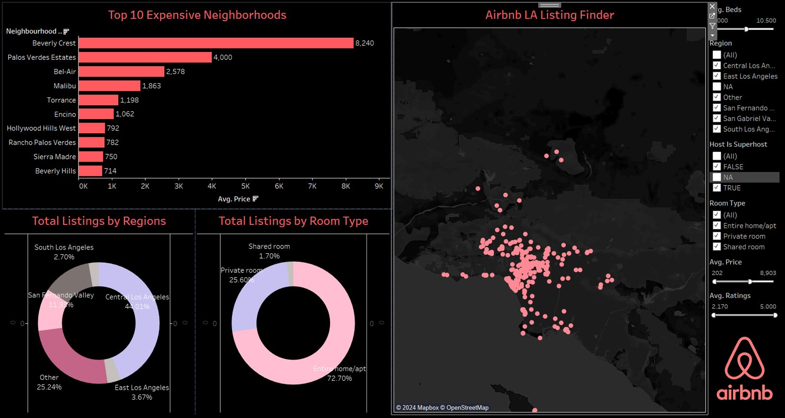

```{=html}
<div class="project-tags">
  <div class="chips">
    <span class="chip hot">R</span>
    <span class="chip">NLP</span>
    <span class="chip">Latent Dirichlet Allocation</span>
    <span class="chip">Random Forest</span>
    <span class="chip">Logistic Regression</span>
    <span class="chip">Tableau</span>
  </div>
</div>

<div class="project-content">

<p class="lede-para">
  Two questions drive this project, and they need different tools. <em>What makes a Los Angeles host a Superhost?</em> is
  a classification problem. <em>What are guests actually complaining about?</em> is buried in unstructured review text.
  The answers meet in a dashboard a host can filter for themselves.
</p>

<div class="results">
  <div class="result"><span class="num">76%</span><span class="lbl">Random forest accuracy on Superhost status</span></div>
  <div class="result"><span class="num">74%</span><span class="lbl">Logistic regression accuracy</span></div>
  <div class="result"><span class="num">2</span><span class="lbl">Datasets joined: listings and reviews</span></div>
</div>

<h2>Host analysis</h2>

<ul>
  <li>Modeled Superhost status against response rate, acceptance rate, review scores, profile completeness, and hosting
  tenure.</li>
  <li>Compared <strong>logistic regression (74% test accuracy)</strong> against a <strong>random forest (76%)</strong>.
  The forest won on accuracy; the regression won on explainability, and both agreed on the ranking of drivers.</li>
  <li>The controllable levers came out on top: <strong>high review scores, acceptance rate, and response rate</strong>.
  Tenure mattered far less than hosts tend to assume.</li>
</ul>

<h2>Review analysis with NLP</h2>

<ul>
  <li>Ran <strong>sentiment analysis</strong> across the review corpus to separate the language of high- and low-rated
  stays.</li>
  <li>Used <strong>Latent Dirichlet Allocation</strong> for topic modeling, surfacing the recurring themes behind poor
  reviews — cleanliness, check-in friction, and gaps between listing photos and reality.</li>
  <li>These are diagnosable problems. A host who reads "the shower pressure" in their topic weights knows exactly what
  to fix, in a way a 4.2-star average never tells them.</li>
</ul>

<h2>Interactive dashboard</h2>

<p>
  The listings side is published as a Tableau dashboard: price distributions by neighborhood and room type, listing
  density on a map of LA, and filters for beds, region, Superhost status, price and rating.
</p>

<div class="tableau-embed">
  <script type="module" src="https://public.tableau.com/javascripts/api/tableau.embedding.3.latest.min.js"></script>
  <tableau-viz
    id="airbnb-tableau-viz"
    src="https://public.tableau.com/views/airbnbdashboard_17164968027300/Dashboard1"
    toolbar="bottom"
    device="desktop"
    hide-tabs>
  </tableau-viz>
</div>

<div class="note">
  <i class="bi bi-info-circle"></i>
  <p>If the embed does not load in your browser, the dashboard is also live on Tableau Public.</p>
</div>



<h2>What I'd tell a host</h2>

<ul>
  <li>Protect the rating and the response rate before anything else — they are the strongest predictors of Superhost
  status and the ones fully under a host's control.</li>
  <li>Treat negative reviews as a topic model, not a tally. The same three or four issues repeat.</li>
  <li>Price against your neighborhood and room type, not against the LA average — the spread between Beverly Crest and
  the citywide median is an order of magnitude.</li>
</ul>

<div class="link-row">
  <a class="file-link" href="https://github.com/kunfupen/LA-Airbnb-Analysis"><i class="bi bi-github"></i> Project repository</a>
  <a class="file-link" href="https://public.tableau.com/app/profile/remi.l5319/viz/airbnbdashboard_17164968027300/Dashboard1"><i class="bi bi-bar-chart"></i> Open in Tableau Public</a>
  <a class="file-link" href="Airbnb Analysis.pdf"><i class="bi bi-file-earmark-pdf"></i> Presentation slides (PDF)</a>
</div>

<nav class="project-nav">
  <a class="prev" href="amazon-purchase-predictor.html"><i class="bi bi-arrow-left"></i> Amazon Purchase Predictor</a>
  <a class="next" href="../projects.html">All projects <i class="bi bi-arrow-right"></i></a>
</nav>

</div>
```
